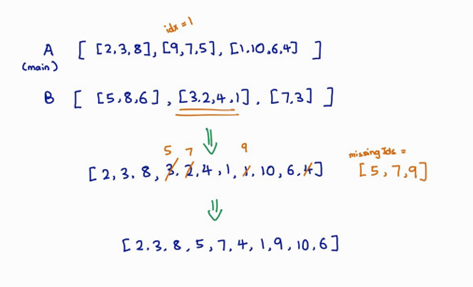

# Algorithm Used
The main algorithm  used to solve this problem is Genetic Algorithm

# Steps
1. Generate Population
2. Selection
3. Crossover
4. Mutation
5. Iterative process of choosing best genes to generate population

# Crossover
Crossover is done using my own algorithm that takes into consideration of the constraints and to ensure no repetition of genes. It is a simpler alternative to crossover methods like partially mapped crossover or cycle crossover

# Results

# Documentation
Detailed explanation are provided in the documentation.docx file